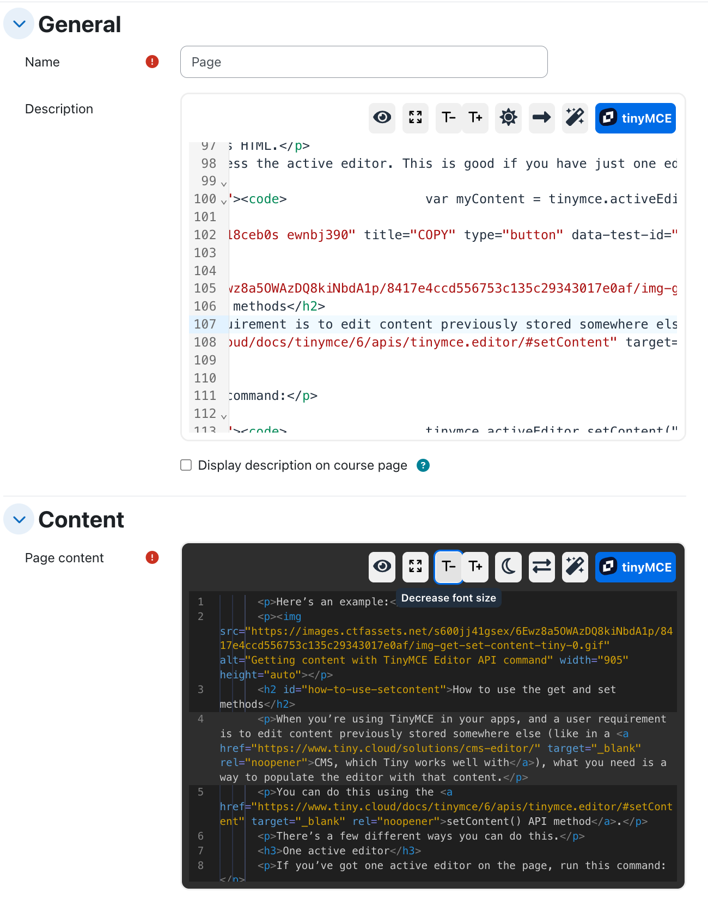

# Source Code Pro for tiny editor

A plugin for the Moodle TinyMCE editor which replaces the basic source code editor shipped by TinyMCE6.
This plugin leverages [codeMirror](https://codemirror.net/) version 6 to provide syntax highlight, autocompletion, block fold, etc.

### UI modes

The code editor can be displayed in two different ways

1. **Dialog**: Only one editor can be edited and changes must be confirmed or rejected.
2. **Panel**: Several editors can be used simulataneously and changes are automatically applied.

An administrador option is used to decide which mode is used by default or it can allow the user to switch among both.



### Features

1. Color syntax and line numbers
2. Search and replace
3. Code formatting
4. Cursor position synchronized with Tiny editor (since v1.1.4)
5. Light and dark themes
6. Toggle fullscreen mode

### Key bindings

Please note that the key Alt corresponds to `Option` in mac computers.

- Shift-Alt-m  Toggle minimap
- Shift-Alt-w  Toggle line wrapping
- Shift-Alt-t  Toggle theme (light/dark)
- Shift-Alt-p  Format code
- Shift-Alt-d  Save preferences as defaults
- Shift-Alt-a  Accept changes
- Shift-Alt-c  Cancel changes


The installation is straightforward: simply go to Site Administration area (Plugins → Install plugins → Install plugin from ZIP file).

Once the plugin is installed, the items named "Source Code" in the menu, will be replaced by "Source Code Pro". Also a button will be added in the first position of the toolbar.


The source code opens in a modal dialogue that can be expanded to fit the entire window. It accepts two themes (light and dark). You will also find a button to toggle line wrapping.


Now, the code can be easily formatted thanks to [htmlfy](https://github.com/j4w8n/htmlfy#readme) library. The following animation shows the editor in action. Enjoy it!


## Configuration

This plugin include the following configuration settings.

- 

The capability 'tiny/codepro:viewplugin' allows to set the plugin visibility for any role.


## Build
### Generate AMD modules

In order to generate the compiled code in `/amd/build` from sources in `/amd/src`, you need to execute the command

```
npx grunt amd
```

### Generate codemirror dependency with extra toppings

Please refer to the documentation in libs/codemirror.
