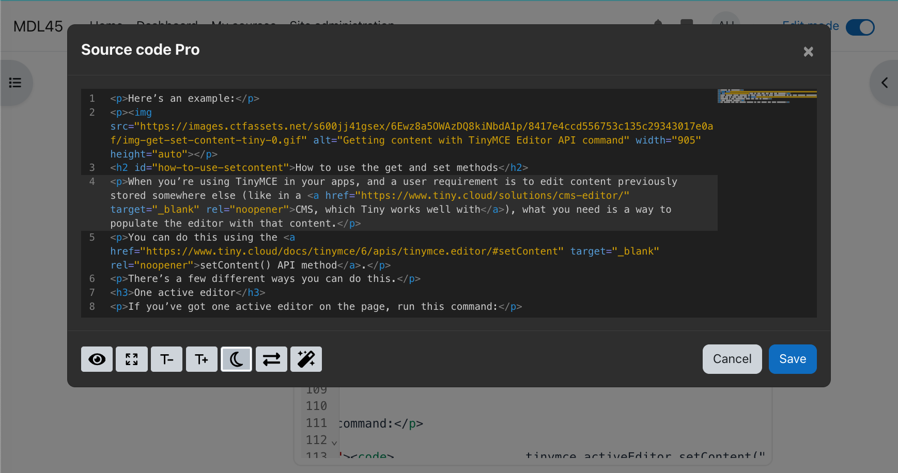

# Source Code Pro for tiny editor

A plugin for the Moodle TinyMCE editor which replaces the basic source code editor shipped by TinyMCE6.
This plugin leverages [codeMirror](https://codemirror.net/) version 6 to provide syntax highlight, autocompletion, block fold, etc.

This plugin does not include any configuration settings. The installation is straightforward: simply go to Site Administration area (Plugins → Install plugins → Install plugin from ZIP file).

Once the plugin is installed, the items named "Source Code" in the menu, will be replaced by "Source Code Pro". Also a button will be added in the first position of the toolbar.


The source code opens in a modal dialogue that can be expanded to fit the entire window. It accepts two themes (light and dark). You will also find a button to toggle line wrapping.




Now, the code can be easily formatted thanks to [htmlfy](https://github.com/j4w8n/htmlfy#readme) library. The following animation shows the editor in action. Enjoy it!


The capability 'tiny/codepro:viewplugin' allows to set the plugin visibility for any role.

Icon by [Fontawesome 6.4](https://fontawesome.com/icons/file-code?f=classic&s=light).

## Generate AMD modules

In order to generate the compiled code in `/amd/build` from sources in `/amd/src`, you need to execute the command

```
npx grunt amd
```

## Generate codemirror dependency with extra toppings

Please refer to the documentation in libs/codemirror.
