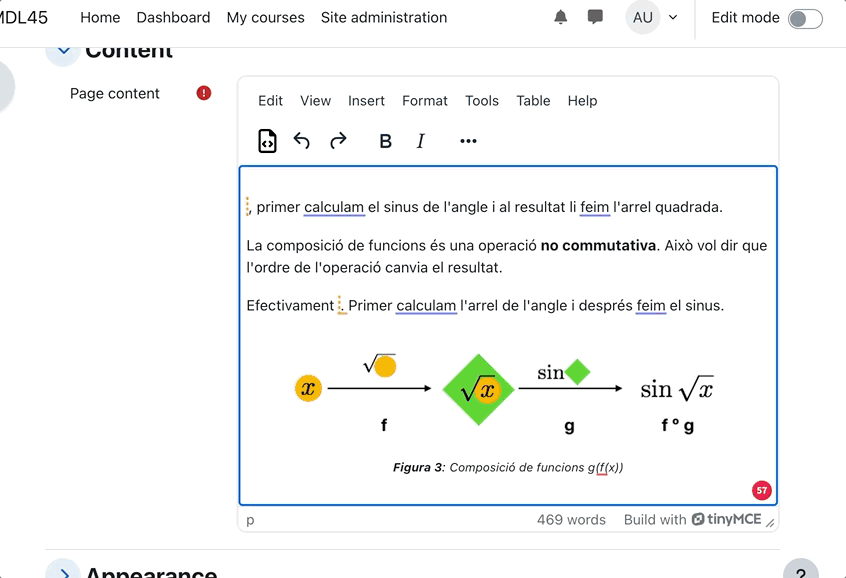
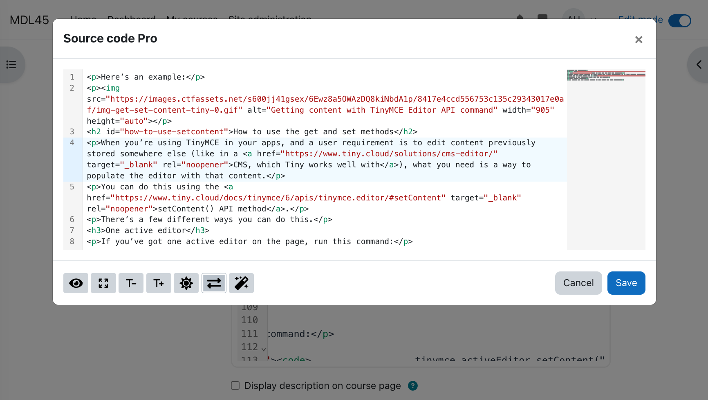
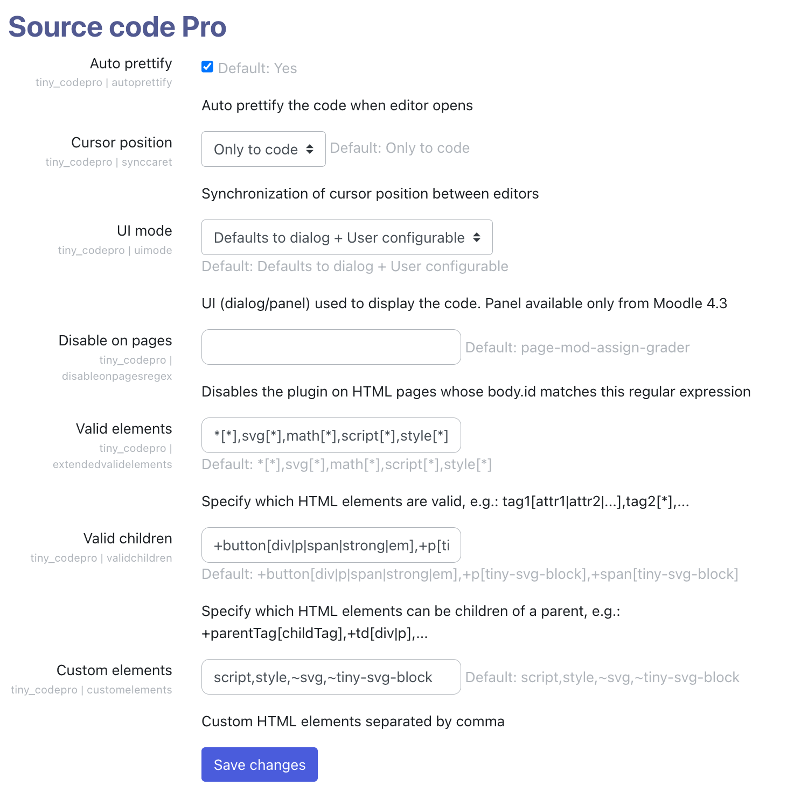

# Source Code Pro for TinyMCE Editor

A Moodle plugin for the TinyMCE editor that enhances the built-in source code editor. 
This plugin leverages [CodeMirror](https://codemirror.net/) version 6 to provide features such as syntax highlighting, 
autocompletion, block folding, and more.

## Compatibility

- **Moodle 4.1 – 4.3**: It replaces the default plain text source code editor.
- **Moodle 4.4 and beyond**: It provides advanced features compared to the default HTML code editor.

## Features

- Syntax highlighting with line numbers
- Search and replace functionality
- Code formatting
- Cursor position synchronization with TinyMCE (since v1.1.4)
- Light and dark themes
- Toggle fullscreen mode
- **New in v2.0**:
  - Dialog and panel UI modes
  - Configurable font size
  - Improved cursor synchronization
  - Color picker
  - VSCode-like minimap



## UI Modes

The code editor can be displayed in two different modes:

1. **Dialog Mode**: A single editor instance is displayed in a modal. Changes must be explicitly confirmed or rejected.
2. **Panel Mode**: Multiple editor instances can be used simultaneously, with changes applied automatically.

An administrator setting allows choosing the default mode or enabling users to switch between both modes.


## Key Bindings

> Note: On macOS, `Alt` corresponds to the `Option` key.

| Shortcut | Action |
|----------|--------|
| `Shift-Alt-M` | Toggle minimap |
| `Shift-Alt-W` | Toggle line wrapping* |
| `Shift-Alt-T` | Toggle theme (light/dark) |
| `Shift-Alt-P` | Format code |
| `Shift-Alt-D` | Save preferences as defaults |
| `Shift-Alt-A` | Accept changes |
| `Shift-Alt-C` | Cancel changes |

*Please note that line wrapping is always enabled in panel mode.

## Installation

1. Navigate to **Site Administration** → **Plugins** → **Install plugins** → **Install plugin from ZIP file**.
2. Once installed:
   - The menu item "Source Code" will be replaced by "Source Code Pro."
   - A new toolbar button will be added in the first position.


The source code editor (in dialog mode) opens in a modal dialog that can expand to fit the full window. It supports both light and dark themes and includes a toggle for line wrapping.




The plugin also integrates with the [htmlfy](https://github.com/j4w8n/htmlfy#readme) library for automatic code formatting.


## Configuration

Administradors can set these options



Additionally, the capability `tiny/codepro:viewplugin` controls visibility for specific roles.

Regular users can configure:

- **Default UI Mode**: Choose between "Dialog" and "Panel" mode.
- **User Mode Switching**: Allow users to switch UI modes.
- **Theme Selection**: Set a default theme or allow users to toggle between light and dark modes.
- **Font Size Configuration**: Adjust font sizes for better readability.

## Build & Development

### Generate AMD Modules

To compile source files from `/amd/src` into `/amd/build`, run:

```sh
npx grunt amd
```

### Build CodeMirror with custom features

Refer to the documentation in `libs/codemirror` for details on modifying the CodeMirror dependency.

## Credits

Thanks to CodeMirror and the awesome CodeMirror plugins developed by [Replit](https://github.com/orgs/replit/repositories?q=codemirror). All icons are obtained from FontAwesome 6 free plugins. Many thanks also to the developers of the [htmlfy](https://www.npmjs.com/package/htmlfy) npm module.

---

Enjoy coding with **Source Code Pro**!
